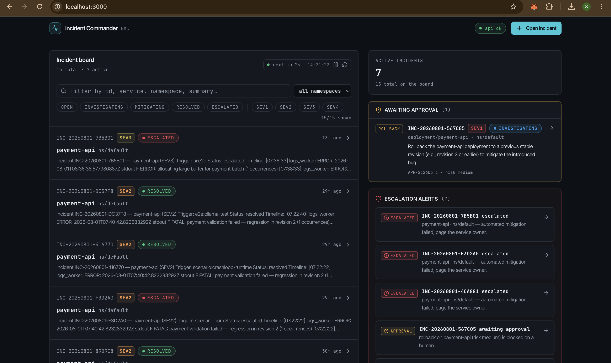
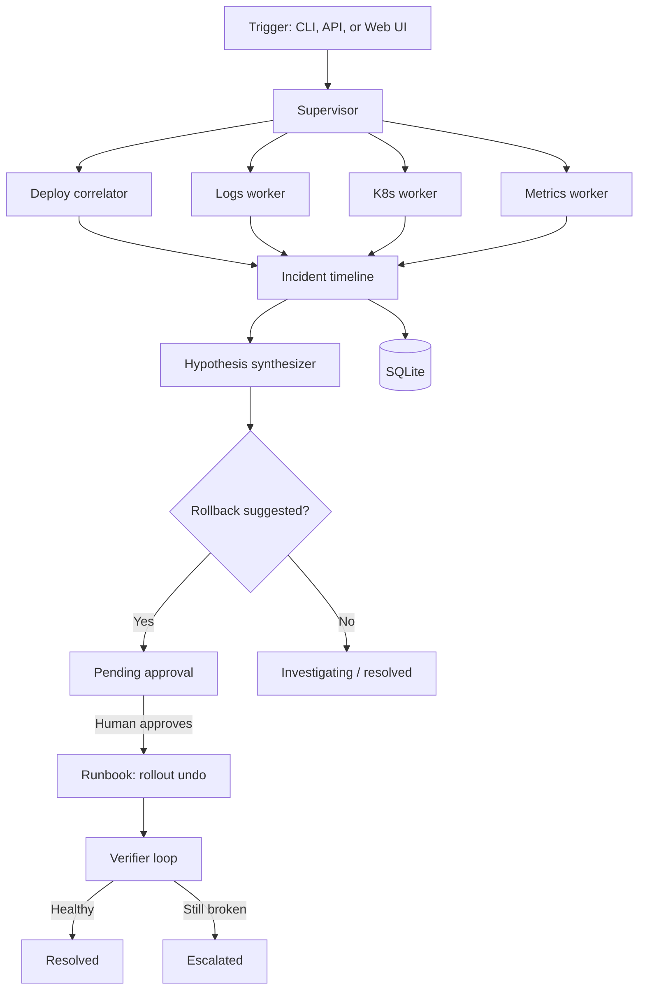

# Incident Commander

[](https://github.com/sahilleth/incident-commander/actions/workflows/ci.yml)
[](https://pypi.org/project/incident-commander/)
[](LICENSE)
[](https://www.python.org/downloads/)

**Open-source AI incident commander for Kubernetes.** When something breaks, Incident Commander opens an investigation, runs parallel agent workers against live cluster data, ranks root-cause hypotheses, and queues safe actions (rollback, scale) for human approval—then verifies recovery.

All integrations are **live**: `kubectl`, Prometheus, Loki, and Groq or Ollama (optional). There is no mock mode in the API or the React dashboard.



```bash
pip install incident-commander
incident-commander doctor

# Terminal 1 — API
incident-commander serve

# Terminal 2 — React dashboard (from a clone)
make frontend-install frontend-dev   # http://localhost:3000
```

Or use the CLI only:

```bash
incident-commander open payment-api --namespace default
```

**PyPI:** [pypi.org/project/incident-commander](https://pypi.org/project/incident-commander) · **Repo:** [github.com/sahilleth/incident-commander](https://github.com/sahilleth/incident-commander)

---

## Table of contents

- [Why Incident Commander](#why-incident-commander)
- [How it works](#how-it-works)
- [Quick start (pip)](#quick-start-pip)
- [Full local demo (kind + observability)](#full-local-demo-kind--observability)
- [Web UI](#web-ui)
- [End-to-end incident flow](#end-to-end-incident-flow)
- [CLI reference](#cli-reference)
- [API reference](#api-reference)
- [Configuration](#configuration)
- [Workers & data sources](#workers--data-sources)
- [Eval & replay](#eval--replay)
- [Development](#development)
- [Contributing & security](#contributing--security)
- [Roadmap](#roadmap)
- [License](#license)

---

## Why Incident Commander

| Tool | Gap |
|------|-----|
| **kubectl / k9s** | Manual, no correlation across deploys, logs, metrics |
| **Dashboards** | Show data; don't build a ranked incident narrative |
| **Enterprise AIOps** | Often closed-source, heavy, or cloud-only |

Incident Commander fills the gap for homelab, small teams, and anyone who wants **agentic incident response** on a real cluster—with **human approval** before destructive actions.

**What you get:**

- **Multi-agent ReAct workers** — deploy, logs, K8s state, and metrics in parallel
- **Hypothesis synthesis** — Groq LLM or deterministic heuristics when no API key
- **Human-in-the-loop actions** — rollback (`kubectl rollout undo`) and scale only after approval
- **React Web UI** — incident board, pending-approval queue, timeline, approve rollback/scale in the browser
- **Post-mitigation verifier** — polls until healthy or escalates
- **Eval harness** — score hypothesis quality on JSON fixtures

---

## How it works



1. **Trigger** — You open an incident for a Kubernetes **Deployment** name.
2. **Workers** — Four agents gather evidence via ReAct loops (deterministic tools + optional LLM).
3. **Synthesize** — Timeline is turned into ranked hypotheses with suggested actions.
4. **Approve** — High-risk actions (rollback, scale) require explicit approval.
5. **Execute & verify** — Runbook runs, then pods/logs/metrics are polled until stable.

**Service name = Deployment name.** Workers resolve pods and ReplicaSets from the deployment's label selector.

See [docs/ARCHITECTURE.md](docs/ARCHITECTURE.md) for agent design: two-phase investigation, LLM-first deploy correlator, ReAct traces, critique pass, and per-incident LLM cost tracking.

---

## Quick start (pip)

For any cluster you already have access to via `kubectl`:

```bash
pip install incident-commander

# Configure (copy from repo or set env vars)
export KUBE_CONTEXT=your-context          # optional
export PROMETHEUS_URL=http://localhost:9090   # if Prometheus reachable
export LOKI_URL=http://localhost:3100           # if using Loki
export LOG_BACKEND=loki                         # or kubectl
export GROQ_API_KEY=gsk_...                     # optional

incident-commander doctor
incident-commander open my-deployment --namespace default --trigger manual:health-check
incident-commander list
incident-commander show INC-20260801-XXXXXX
```

Without `GROQ_API_KEY`, hypotheses still work via **heuristic ranking** from timeline evidence.

---

## Full local demo (kind + observability)

Run the entire stack on your laptop with Docker, kind, Prometheus, and Loki—no port-forward required (host ports are wired in `k8s/kind-config.yaml`).

### Prerequisites

- Python 3.11+
- Docker Desktop (running)
- `kubectl`
- `kind` (`brew install kind`)

### 1. Clone and install

```bash
git clone https://github.com/sahilleth/incident-commander.git
cd incident-commander

python3 -m venv .venv
source .venv/bin/activate
pip install -e ".[dev]"

cp .env.example .env
# Optional: add GROQ_API_KEY and GROQ_API_KEY_FALLBACK
```

### 2. Create cluster + sample app

```bash
./scripts/setup-k8s.sh
```

Creates kind cluster `incident-commander` (kubectl context `kind-incident-commander`), wires **localhost:9090** (Prometheus) and **localhost:3100** (Loki), and deploys sample `payment-api`.

If an old cluster lacks host ports:

```bash
KIND_RECREATE=1 ./scripts/setup-k8s.sh
```

### 3. Install observability stack

```bash
./scripts/setup-observability.sh
```

Deploys Prometheus, kube-state-metrics, Loki, and Promtail into namespace `monitoring`.

Ensure `.env` includes:

```env
LOG_BACKEND=loki
PROMETHEUS_URL=http://localhost:9090
LOKI_URL=http://localhost:3100
KUBE_CONTEXT=kind-incident-commander
```

### 4. Verify environment

```bash
incident-commander doctor
```

Expect: `kubectl`, `prometheus`, `loki`, and `groq` (if configured) all **ok**.

### 5. Run a scripted bad-deploy scenario

```bash
make scenario-bad-deploy
```

This applies a broken rollout (crashloop + error logs), runs a full investigation, prints hypotheses, and restores the healthy deployment.

### 6. Start the API and Web UI

```bash
# Terminal 1 — API + SQLite persistence
incident-commander serve
# → http://localhost:8080 (OpenAPI docs at /docs)

# Terminal 2 — React dashboard
make frontend-install
make frontend-dev
# → http://localhost:3000
```

The Vite dev server proxies `/api` to the backend. Open the dashboard, browse incidents from your scenarios, and approve rollback or scale from the UI.

### 7. Run more live scenarios

```bash
make scenario-imagepull
make scenario-oom
make scenario-crashloop-runtime
```

Each script applies a broken manifest, waits for failure signals, opens an investigation, and restores the healthy deployment on exit (unless `KEEP_BROKEN=1`).

### 8. Smoke-test the UI API wiring

```bash
make frontend-e2e
```

Hits every REST endpoint the dashboard uses (health, list, get, postmortem, create, investigate, approve).

---

## Web UI

The production dashboard lives in `frontendUI/` — a React app (TanStack Start, React Query, Tailwind, shadcn/ui) that talks to the FastAPI backend over REST. **No mock data**: every screen reads from `incident-commander serve`.

### Run locally

| Service | URL | Role |
|---------|-----|------|
| **React UI** (dev) | http://localhost:3000 | Dashboard — use this day-to-day |
| **API** | http://localhost:8080 | REST + OpenAPI (`/docs`) |
| **API via UI proxy** | http://localhost:3000/api | Same origin in dev (Vite proxy) |

```bash
incident-commander serve          # port 8080
make frontend-install frontend-dev  # port 3000
```

Optional env in `frontendUI/.env` (see `frontendUI/.env.example`):

| Variable | Default | Description |
|----------|---------|-------------|
| `VITE_API_URL` | `/api` | API base URL for `fetch` |
| `VITE_API_PROXY_TARGET` | `http://localhost:8080` | Backend target for Vite dev proxy |

### What you can do in the UI

| Feature | Description |
|---------|-------------|
| **Incident board** | All incidents from SQLite, filters by status/severity/namespace, auto-refresh while active |
| **Awaiting approval** | Clickable sidebar panel listing every pending rollback/scale with links to the incident |
| **Open incident** | Dispatch workers against a deployment (service name = Deployment name) |
| **Incident detail** | Timeline, ranked hypotheses, worker runs, pending approvals |
| **Approve rollback / scale** | Confirm destructive kubectl actions; verifier runs after approval (can take up to ~1 minute) |
| **Re-investigate** | Re-run all workers on an open incident |
| **Postmortem** | Download Markdown report |
| **Export timeline** | Markdown, CSV, or JSON |
| **Escalation alerts** | Sidebar toasts when SEV1, escalations, or new approvals appear |

After you approve an action, the UI updates immediately and pauses auto-refresh until the API call completes so the pending-approval list does not flicker back.

### Production build

```bash
make frontend-build
incident-commander serve
```

If a static build exists under `frontendUI/dist/client/`, `frontendUI/dist/`, or `frontendUI/.output/public/`, `incident-commander serve` can serve it at `/` and `/ui` (legacy HTML fallback if none is found). For local development, prefer **:3000** with the API on **:8080**.

More detail: [frontendUI/README.md](frontendUI/README.md).

---

## End-to-end incident flow

You can run the full loop from the **Web UI** (http://localhost:3000) or the **CLI**. The steps are the same: open → review → approve → verify.

### Via Web UI

1. Open http://localhost:3000 (with `incident-commander serve` running on :8080).
2. Click an incident on the board, or use **Open incident** for `payment-api` in `default`.
3. Review the evidence timeline and ranked hypotheses.
4. In **Pending approvals**, click **Approve rollback** (or scale), confirm in the dialog.
5. Wait for kubectl + verifier (progress message shown; typically 15–60 seconds).
6. Status becomes **resolved** or **escalated**; download postmortem or export timeline if needed.

The **Awaiting approval** sidebar lists every pending action across incidents—click a row to jump straight to that incident.

### Via CLI

1. **Open and investigate**

```bash
incident-commander open payment-api \
  --namespace default \
  --trigger pagerduty:high-error-rate \
  --severity SEV1
```

Workers run in parallel. Output includes timeline, worker summaries, ranked hypotheses, and any **pending approvals**.

2. **Review**

```bash
incident-commander show INC-20260801-XXXXXX
```

3. **Approve rollback or scale** (if suggested)

```bash
incident-commander approve INC-20260801-XXXXXX APR-xxxxxxxx
```

Runs the approved runbook (`kubectl rollout undo` or `kubectl scale`), then the **verifier** polls every `VERIFY_INTERVAL_SECONDS` (default 15s) until:

- Pods are healthy
- Error logs quiet down
- Error rate acceptable (if Prometheus is available)

Outcome: **resolved** or **escalated**.

### Example timeline (bad deploy)

| Source | Signal |
|--------|--------|
| `deploy_correlator` | New ReplicaSet revision 4 |
| `logs_worker` | `NullPointerException in PaymentValidator` (Loki) |
| `k8s_worker` | Pod crashloop, 2 restarts |
| `metrics_worker` | Elevated restart rate (Prometheus) |

**Hypothesis (85%):** Recent deploy introduced regression → **rollback** queued for approval.

---

## CLI reference

| Command | Description |
|---------|-------------|
| `incident-commander open <deployment>` | Open incident and run all workers |
| `incident-commander list` | List recent incidents |
| `incident-commander show <INC-ID>` | Full incident detail |
| `incident-commander approve <INC-ID> <APR-ID>` | Approve rollback or scale |
| `incident-commander doctor` | Check kubectl, Prom, Loki, Groq |
| `incident-commander eval` | Run built-in eval scenarios |
| `incident-commander record <INC-ID>` | Export incident as eval fixture |
| `incident-commander export <INC-ID>` | Postmortem Markdown (`-o` file) |
| `incident-commander serve` | REST API on `http://localhost:8080` |

### `open` options

```bash
incident-commander open payment-api \
  --namespace production \
  --trigger manual:health-check \
  --severity SEV1
```

| Option | Default | Description |
|--------|---------|-------------|
| `--namespace` | `default` | Kubernetes namespace |
| `--trigger` | `manual` | Source label (PagerDuty, alert name, etc.) |
| `--severity` | `SEV2` | SEV1–SEV4 style label |

---

## API reference

```bash
incident-commander serve
# API docs: http://localhost:8080/docs
```

| Method | Path | Description |
|--------|------|-------------|
| `GET` | `/` , `/ui` | Web UI (built React app, or legacy HTML fallback) |
| `GET` | `/api/health` | Health check (also at `/health`) |
| `POST` | `/api/incidents` | Open + investigate (also at `/incidents`) |
| `GET` | `/api/incidents` | List recent |
| `GET` | `/api/incidents/{id}` | Get incident |
| `GET` | `/api/incidents/{id}/postmortem.md` | Postmortem Markdown |
| `POST` | `/api/incidents/{id}/investigate` | Re-run workers |
| `POST` | `/api/incidents/{id}/approve` | Approve pending action |
| `POST` | `/webhooks/alertmanager` | Alertmanager → auto-open incidents |

Legacy root paths (`/health`, `/incidents`, …) remain for backward compatibility.

**Open incident:**

```bash
curl -s -X POST http://localhost:8080/api/incidents \
  -H 'Content-Type: application/json' \
  -d '{
    "service": "payment-api",
    "namespace": "default",
    "trigger": "manual",
    "severity": "SEV2"
  }'
```

**Approve rollback or scale:**

```bash
curl -s -X POST http://localhost:8080/api/incidents/INC-.../approve \
  -H 'Content-Type: application/json' \
  -d '{"approval_id": "APR-..."}'
```

**Alertmanager webhook** (configure in Prometheus Alertmanager):

```yaml
receivers:
  - name: incident-commander
    webhook_configs:
      - url: http://incident-commander:8080/webhooks/alertmanager
        send_resolved: false
```

Labels `deployment`, `service`, or `app` on alerts map to the incident service name.

> The API has no authentication in v0.2.0. Do not expose it on untrusted networks.

---

## Configuration

Copy `.env.example` to `.env` or set environment variables.

### LLM (Groq or Ollama)

| Variable | Default | Description |
|----------|---------|-------------|
| `LLM_PROVIDER` | `groq` | `groq`, `ollama`, or `openai` |
| `GROQ_API_KEY` | — | Primary Groq API key ([console.groq.com](https://console.groq.com)) |
| `GROQ_API_KEY_FALLBACK` | — | Second key; used when primary is rate-limited |
| `GROQ_MODEL` | `llama-3.3-70b-versatile` | Groq model name |
| `OLLAMA_MODEL` | `llama3.2` | Ollama model when using local LLM |
| `LLM_BASE_URL` | Groq URL | OpenAI-compatible base URL |

**Ollama (no cloud API key):**

```bash
ollama pull llama3.2
export LLM_PROVIDER=ollama
export LLM_BASE_URL=http://localhost:11434
incident-commander doctor
```

### Kubernetes

| Variable | Default | Description |
|----------|---------|-------------|
| `KUBECONFIG` | — | Path to kubeconfig |
| `KUBE_CONTEXT` | — | Context name (e.g. `kind-incident-commander`) |

### Logs

| Variable | Default | Description |
|----------|---------|-------------|
| `LOG_BACKEND` | `kubectl` | `loki` or `kubectl` (pod log tail) |
| `LOKI_URL` | `http://localhost:3100` | Loki base URL |

### Metrics

| Variable | Default | Description |
|----------|---------|-------------|
| `PROMETHEUS_URL` | `http://localhost:9090` | Prometheus base URL |
| `PROM_ERROR_RATE_QUERY` | kube-state-metrics restart rate | PromQL; use `{service}` and `{namespace}` |
| `PROM_P99_LATENCY_QUERY` | `vector(0)` | Override for app latency metrics |
| `PROM_REQUEST_RATE_QUERY` | pod count query | Override for RPS-style metrics |

Default Prom queries use **kube-state-metrics**. If your app exports `http_requests_total`, override the `PROM_*_QUERY` templates in `.env`.

### Orchestrator

| Variable | Default | Description |
|----------|---------|-------------|
| `INCIDENT_DB_PATH` | `./data/incidents.db` | SQLite database |
| `MAX_WORKER_ITERATIONS` | `5` | ReAct loop limit per worker |
| `WORKER_TIMEOUT_SECONDS` | `120` | Worker timeout |
| `KUBECTL_TIMEOUT_SECONDS` | `30` | kubectl command timeout |
| `DEPLOY_LOOKBACK_MINUTES` | `60` | How far back to search for deploys |
| `VERIFY_MAX_ATTEMPTS` | `5` | Verifier poll attempts after rollback |
| `VERIFY_INTERVAL_SECONDS` | `15` | Seconds between verifier polls |
| `VERIFY_MAX_ERROR_COUNT` | `10` | Max error log lines before fail |

---

## Workers & data sources

Each worker runs a **Reason → Act → Observe** loop (deterministic steps first, optional Groq ReAct if configured).

| Worker | What it does | Data source |
|--------|----------------|-------------|
| **deploy_correlator** | Recent ReplicaSets, rollout history | `kubectl get rs`, rollout history |
| **logs_worker** | Top error patterns in time window | Loki `query_range` or `kubectl logs` |
| **k8s_worker** | Pod health, restarts, warning events | Pod status, events API |
| **metrics_worker** | Error rate, RPS, latency snapshot | Prometheus instant queries |

Workers run **in parallel**. Results merge into a single timeline before hypothesis synthesis.

---

## Eval & replay

Built-in scenarios ship with the package (no extra download):

```bash
incident-commander eval
```

| Scenario | What it tests |
|----------|----------------|
| `bad_deploy` | Deploy + NPE + crashloop → rollback suggestion |
| `crashloop_no_deploy` | Errors without recent deploy |
| `healthy_cluster` | Weak signals → no false rollback |

Record a real incident as a fixture:

```bash
incident-commander record INC-20260801-XXXXXX
```

Fixture source files: `src/incident_commander/eval/fixtures/`.

---

## Development

```bash
make install          # editable Python install with dev deps
make test             # pytest
make eval             # eval scenarios
make check            # compile + test + eval (CI runs this)
make frontend-install # bun install in frontendUI/
make frontend-dev     # React UI on :3000 (API must be on :8080)
make frontend-build   # production bundle
make frontend-e2e     # smoke-test UI API endpoints
make scenario-bad-deploy   # live kind scenario
make build            # wheel for PyPI
```

### Project layout

```
src/incident_commander/
  agents/          # ReAct loop engine
  workers/         # Deploy, logs, k8s, metrics
  orchestrator/    # Commander, runbook, verifier
  llm/             # Groq / Ollama client + synthesizer
  tools/           # kubectl, Prometheus, Loki clients
  eval/            # Replay runner + fixtures
  api/             # FastAPI app + legacy static HTML
frontendUI/        # React dashboard (TanStack Start)
k8s/               # kind config, monitoring, sample apps, scenarios
scripts/           # setup-k8s, observability, scenarios, frontend-e2e
tests/
```

### Makefile targets (clone only)

| Target | Description |
|--------|-------------|
| `make setup-k8s` | Create kind cluster + payment-api |
| `make setup-observability` | Prometheus + Loki on kind |
| `make scenario-bad-deploy` | Live bad-deploy demo |
| `make scenario-imagepull` | ImagePullBackOff scenario |
| `make scenario-oom` | OOMKilled scenario |
| `make scenario-crashloop-runtime` | Runtime crashloop (dependency errors) |
| `make frontend-install` | Install frontendUI dependencies (Bun) |
| `make frontend-dev` | Vite dev server on :3000 |
| `make frontend-build` | Build React app to `frontendUI/dist/` |
| `make frontend-e2e` | Smoke-test REST endpoints used by the UI |
| `make observability-forward` | Fallback port-forward if host ports missing |

---

## Contributing & security

- [CONTRIBUTING.md](CONTRIBUTING.md) — dev setup, PRs, eval fixtures
- [SECURITY.md](SECURITY.md) — report vulnerabilities privately
- [docs/PUBLISHING.md](docs/PUBLISHING.md) — PyPI release process

---

## Roadmap

- [x] Ollama / local LLM
- [x] Alertmanager webhook trigger
- [x] React Web UI (board, timeline, approve rollback/scale, pending-approval queue)
- [x] Postmortem Markdown export
- [x] Live scenarios (imagepull, OOM, crashloop-runtime)
- [x] Scale runbook (`kubectl scale`)
- [x] LLM-first deploy correlator (agent chooses tool order)
- [x] Native LLM tool calling (ReAct + synthesizer)
- [x] Agent reasoning trace in Web UI
- [x] Cross-worker context (deploy timestamp → log window)
- [x] Hypothesis critique / reflection pass
- [x] Per-investigation LLM token & cost tracking
- [ ] Postmortem PDF export
- [ ] Helm chart for in-cluster deployment
- [ ] API authentication

---

## License

Apache License 2.0 — see [LICENSE](LICENSE).

Copyright 2026 Incident Commander Contributors
