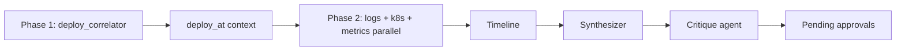

# Agent architecture

Incident Commander uses a **supervisor + worker** pattern: the orchestrator (`IncidentCommander`) dispatches specialized workers, merges evidence into a shared timeline, synthesizes hypotheses, and gates destructive runbooks behind human approval.

## Investigation phases



1. **Phase 1** — `DeployCorrelatorWorker` runs alone to find recent ReplicaSet / rollout changes.
2. **Phase 2** — `LogsWorker`, `K8sWorker`, and `MetricsWorker` run in parallel. Logs receives `deploy_at` from phase 1 to search a tight window around the deploy before widening.
3. **Synthesis** — `HypothesisSynthesizer` ranks root-cause hypotheses (LLM tool call or heuristics).
4. **Critique** — For top hypothesis with confidence ≥ 0.55, a reflection pass may lower confidence and append a `critique_agent` timeline event.
5. **Approval** — Rollback / scale actions above the confidence threshold queue as `PendingApproval` until a human approves in the UI or API.

## ReAct workers

Each worker runs a **Reason → Act → Observe** loop (`agents/react.py`):

| Component | Role |
|-----------|------|
| `ReActTool` | Callable tool exposed to the LLM via native function calling |
| `run_llm` | LLM chooses tools until it responds with plain text (finished) |
| `run_deterministic` | Fixed step sequence used as fallback when LLM is unavailable or fails |
| `ReActStepRecord` | Per-iteration thought / action / observation trace |

`DeployCorrelatorWorker` is **LLM-first** when an API key or Ollama endpoint is configured: the model picks tool order (`recent_deploys_since_incident` → `recent_deploys_expanded` → `rollout_history`) instead of a hardcoded sequence.

Worker traces are stored on `WorkerRun.steps` and surfaced in the React UI under **Agent reasoning**.

## LLM integration

- **Provider** — Groq, Ollama, or any OpenAI-compatible API (`llm/llm_client.py`).
- **Tool calling** — ReAct loops and hypothesis synthesis use `tools=[...]` / `tool_calls` instead of hand-parsed JSON blobs.
- **Usage tracking** — Every `chat_completion` in an investigation accumulates into `Incident.llm_usage` (calls, tokens, estimated USD). Visible in the API, postmortem export, and incident detail header.

## Human-in-the-loop

Rollback (`kubectl rollout undo`) and scale (`kubectl scale`) run only after explicit approval. The verifier polls pods, logs, and metrics until healthy or escalates.

## Key paths

```
src/incident_commander/
  agents/react.py           # ReAct loop engine
  workers/                  # deploy, logs, k8s, metrics
  orchestrator/commander.py # two-phase investigate, critique, approvals
  llm/synthesizer.py        # hypothesis synthesis + critique
  llm/usage.py              # per-investigation token/cost accumulator
```
